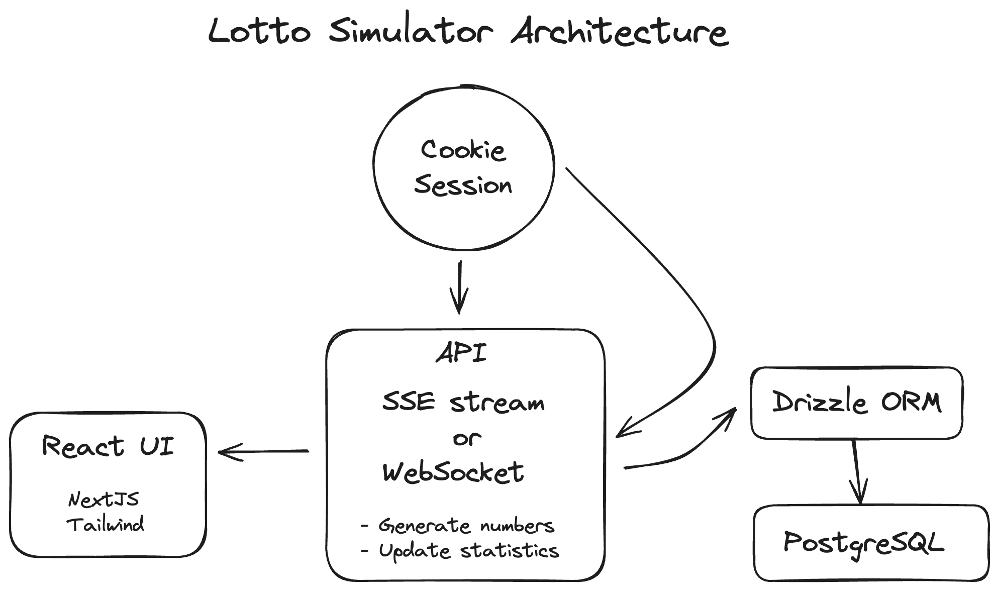

# 🧱 Architecture Overview – Lotto Simulator

## 🌐 Application Layers

```text
[Browser (Client)]
    ↓
[Next.js App Router (React, TypeScript)]
    ↓
[API Routes – /api/draw, /api/simulate/stream, /api/stats]
    ↓
[Drizzle ORM abstraction]
    ↓
[NeonDB PostgreSQL database]
```

---

## ⚙️ Technologies Used

| Layer      | Technology                        |
| ---------- | --------------------------------- |
| Frontend   | React (App Router), Tailwind      |
| UI Layer   | DrawPanel, SimulationStats, etc.  |
| API Layer  | Next.js API Routes (Edge-ready)   |
| Streaming  | Server-Sent Events (SSE)          |
| WebSocket  | Socket.io (WS)                    |
| DB Access  | Drizzle ORM                       |
| DB Engine  | NeonDB (PostgreSQL)               |
| Sessions   | HTTP Cookie + SessionId           |
| Randomness | `crypto.getRandomValues()` (Node) |

---

## 📦 Core Modules

- `server.js`

  - The Socket.IO server can share the same underlying HTTP server with Next.js
  - A custom server cannot be deployed on Vercel

- `/src/app/api/draw/route.ts`

  - Handles one-off draw requests

- `/src/app/api/simulate/stream/route.ts`

  - Streams draws continuously via SSE

- `/src/app/api/stats/route.ts`

  - Returns statistics for current session

- `src/app/(SSE)/page.tsx`

  - SSE version page

- `/src/app/(WS)/ws/page.tsx`

  - WS version page

- `/lib/utils.ts`

  - Random number generation, match logic

- `/lib/session.ts`

  - Cookie-based session management

- `/drizzle/schema.ts`

  - Drizzle schema definition: sessions, draws

---

## 🧠 Business Logic Rules

- 5 numbers are drawn from \[1–90] (unique, sorted)
- Fixed or random player numbers
- Simulation ends if:

  - Jackpot hit (5 matches)
  - 26,000 draws (≈500 years)

- Only draws with ≥2 matches are stored

---

## 🗃️ Data Structure (Database)

### sessions

| id  | created_at |
| --- | ---------- |

### draws

\| id | session_id | draw_numbers | player_numbers | match_count | created_at |

---

## 📈 SimulationResult Payload

```ts
interface SimulationResult {
  numOfTickets: number
  yearsSpent: number
  costOfTickets: number
  winMatches: Record<2 | 3 | 4 | 5, number>
  matchCount: number
  winningNumbers: number[]
  playerNumbers: number[]
  speed: number
  isRandom: boolean
  jackpot: boolean
}
```

---

## 🔐 Session Lifecycle

- Session ID is stored in `HttpOnly` cookie
- `getOrCreateSessionId()` returns current or creates new
- All draw results are linked to this session

---

## 📊 Diagram Preview



## 🖼️ Screenshots


